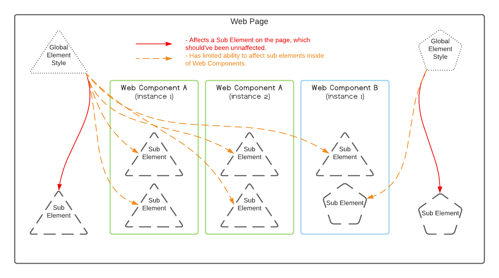

# Web Bling

The goal of this repo is to explore some approaches
to managing styles for web components, while maintaining a minimum of bloat.

**NOTE 1**: Unit tests are NOT a concern here. The unit testable code is kept at a minimum,
and the primary goal is in assessing bundle size and memory consumption.

**NOTE 2**: The contents of `apps/demo/src/app/large-style-sheet.scss` is from a stylesheet on https://angular.io. It's used
to help more accurately gauge the bundle size and memory growth of the app when I use different styling strategies.

**NOTE 3**: Results are gathered from a page using `nx serve` using default settings.

## Concerns

The following list will be the criteria by which I evaluate the viability and value of
each approach:

- The effect of the web component styles bleeding onto the rest of the web page - Violates 
  the goal of creating a self-contained web component.
- Style duplication per instance of the same web component - Would quickly bloat a web page.
- Shared style duplication per web component. This falls into two categories:
  * Copy and pasted styles from one web component to another - Violates the DRY principle
  * Same mixin is used in separate web components, resulting in the compiled CSS containing duplicate styles.

## Trying the Strategies

The different styles can be tested by commenting and uncommenting a module import in `apps/demo/src/app/app.module.ts`. 

### Strategies

In attempting to use web components derived from components in a regular Angular app that makes use of global styles,
it is very easy to fall into an unacceptable styling situation (illustrated below). This section outlines several
strategies to handle this, with illustrations of each.

**NOTE**: Web components shouldn't rely on global styles. Yet, elements within a component may depend on common styles. 
Therefore, "semi-global" styles may be necessary, meaning that they behave like global styles, but are scoped to children
of the web component.

### Bundled

In this approach, shared styles are repeated for each web component and subcomponent that needs them.

**This strategy wasn't even attempted as it stood to incorporate far too much style duplication.**

### Bundled with Semi-Global

In this approach, semi-global styles are imported into the entry component's style sheet. 

**Modules**:
- _BundledStylesModule_

**Heap Size**: 6.9MB

**Build Results**

| Initial Chunk Files | Names         |      Size |
|---------------------|---------------|----------:|
| vendor.js           | vendor        |   2.45 MB |
| main.js             | main          |   2.22 MB |
| input.css           | input         | 159.25 kB |
| header-span.css     | header-span   | 159.24 kB |
| global.css          | global        | 159.20 kB |
| polyfills.js        | polyfills     | 155.66 kB |
| runtime.js          | runtime       |   6.15 kB |
|                     |               |           |
|                     | Initial Total |   5.29 MB |

### Lazy Loaded

In this approach, semi-global styles are imported via link tags in the entry component's template.

**Modules**:
- _LazyLoadedStylesModule_: Adds the link tags directly to the template.
- _WaitForLazyStylesModule_: Adds the link tags to the web component programmatically, with a hook for completion. 
  (NOT PROFILED - Adds more functionality, but essentially works on same method.)

**Heap Size**: 6.2MB

**Build Results**

| Initial Chunk Files | Names         |      Size |
|---------------------|---------------|----------:|
| vendor.js           | vendor        |   2.45 MB |
| input.css           | input         | 159.25 kB |
| header-span.css     | header-span   | 159.24 kB |
| global.css          | global        | 159.20 kB |
| polyfills.js        | polyfills     | 155.66 kB |
| main.js             | main          |  28.25 kB |
| runtime.js          | runtime       |   6.15 kB |
|                     |               |           |
|                     | Initial Total |   3.10 MB |
